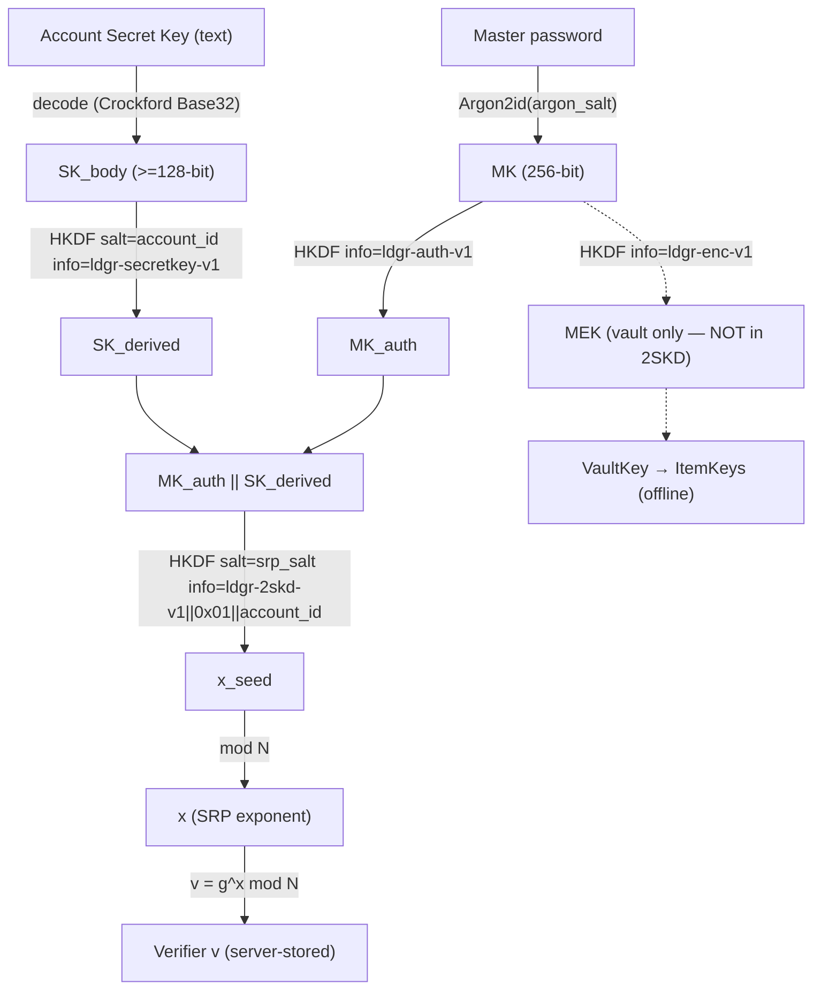

# ADR-008: Self-Hosting Model + Two-Secret Account Authentication

**Status**: Accepted  
**Date**: 2026-06-26  
**Decision makers**: @kafkade  

## Context

ldgr is local-first and zero-knowledge: a vault is an encrypted SQLite database that opens
**fully offline** with no server account (ADR-001, ADR-004). The optional sync server
(`ldgr-server`, AGPL-3.0) only ever stores encrypted blobs plus an SRP-6a `(salt, verifier)`
pair per user — it never sees plaintext or passwords.

We now want two things that today's design does not cover:

1. **Self-hosting in the Immich style** — a single `docker-compose up`, an admin onboarding
   flow, multi-user accounts, and a registration policy. There is no account/identity ADR yet
   (ADRs run 001–007); the server's `users` table is minimal `(id, username, salt, verifier,
   created_at)`.
2. **1Password-style two-secret authentication** — a master password **plus** a high-entropy
   account **Secret Key**. With SRP-6a alone, the server's stored verifier is only as strong as
   the user's password: a server compromise lets an attacker run an offline dictionary attack
   against `v = g^x mod N`. A Secret Key the server never receives raises the offline brute-force
   floor to ≥128 bits *regardless of password strength*.

### The tension this ADR must resolve

The vault **already** has its own secrets and its own offline key hierarchy:

```
password → Argon2id(salt) → MK → HKDF ─┬→ AuthKey  ("ldgr-auth-v1")  → SRP input
                                        └→ MEK      ("ldgr-enc-v1")   → wraps VaultKey → wraps ItemKeys
                                                  (256-bit RecoveryKey can also unwrap VaultKey)
```

A naive "1Password clone" would fold the Secret Key into vault decryption — which would **break
local-first**, because the vault could no longer open without the server-era Secret Key. The
central decision below (Decision 3) rules that out. The Secret Key is an **auth/sync** secret,
not a vault secret.

### Constraints

- `ldgr-core` is zero-I/O (ADR-005). All 2SKD primitives must be **pure functions**; HTTP stays
  in platform code (CLI/reqwest, Swift/URLSession, web/fetch).
- The change must be **backward compatible** at the server schema level — existing single-secret
  accounts must keep working (see `## Migration`).
- Licensing split (ADR-006) must be respected: AGPL is confined to `ldgr-server`; `apps/web` and
  `ldgr-core` are Apache-2.0.

## Decision

Adopt a self-hostable, multi-user server with **two-secret key derivation (2SKD)** layered on top
of the existing SRP-6a handshake, while keeping the local vault openable offline with the master
password (and the vault recovery key for emergencies).

### 1. Two-Secret Key Derivation (2SKD)

The SRP private exponent `x` is derived from **both** the master password and the account Secret
Key. Neither secret alone yields `x`; the server stores only `salt` and `v = g^x mod N`.

#### Inputs

| Symbol | Definition |
| --- | --- |
| `MK` | `Argon2id(password, argon_salt, params)` — the existing 256-bit master key (`kdf.rs`). |
| `MK_auth` | `HKDF-SHA256(ikm = MK, salt = ∅, info = "ldgr-auth-v1")` — the existing AuthKey path, unchanged. |
| `SK` | Account Secret Key, ≥128-bit random body decoded from its text form (Decision 2). |
| `SK_derived` | `HKDF-SHA256(ikm = SK_body, salt = account_id, info = "ldgr-secretkey-v1")` → 32 bytes. |
| `account_id` | Server-assigned UUIDv7 for the account; binds derivation to one identity. |
| `srp_salt` | Per-account random salt (≥16 bytes), stored server-side as today. |

#### Combine → SRP secret

```
ver_byte = 0x01
x_seed   = HKDF-SHA256(
               ikm  = MK_auth || SK_derived,         # concatenation, 64 bytes
               salt = srp_salt,
               info = "ldgr-2skd-v1" || ver_byte || account_id
           )                                          # 32 bytes
x        = OS2IP(x_seed) mod N                        # SRP-6a private exponent
v        = g^x mod N                                  # SRP-6a verifier (server-stored)
```

- **Hash/KDF params**: Argon2id parameters are unchanged (`Argon2Params::{desktop,mobile,wasm}`
  in `kdf.rs`). All HKDF steps use SHA-256, matching the SRP group's hash and the existing key
  hierarchy. SRP group is the RFC 5054 2048-bit group, `g = 2`, as today (`srp.rs`).
- **Domain separation**: `"ldgr-secretkey-v1"` and `"ldgr-2skd-v1"` are new info tags, distinct
  from the vault tags (`"ldgr-auth-v1"`, `"ldgr-enc-v1"`, `"ldgr-vault-wrap-v1"`, …). The version
  byte `0x01` inside the `info` allows future construction changes without ambiguity.
- **account-id binding**: mixing `account_id` into both `SK_derived` and `x_seed` prevents a
  Secret Key from being replayed across accounts and ties the verifier to one identity.
- **Purity**: `x_seed` and `v` derivation are pure and live in `ldgr-core::crypto` (computable in
  WASM). The HTTP round-trip that submits `(salt, v)` and runs the handshake stays in platform code.



The dotted branch is the **vault** path. It is intentionally disconnected from the Secret Key:
the Secret Key never touches vault decryption (Decision 3).

### 2. Secret Key format

A versioned, human-transcribable string reusing the Crockford Base32 helpers already in
`crypto/recovery.rs` (case-insensitive, confusable-normalized, dash-grouped).

```
A1-7QK2R9-XJ4F NK8H 2W6P QyourD M3VT 9B0C    (spaces/dashes ignored on decode)
└┬┘ └──┬─┘ └──────────────┬──────────────┘
 │     │                  └ ≥128-bit random body, Crockford Base32 (26 chars = 130 bits)
 │     └ account-id tag (6 Crockford chars, first 30 bits of account_id) — disambiguation/UX only
 └ version prefix: 'A' (ldgr account key) + '1' (scheme version)
```

| Field | Bytes/bits | Purpose |
| --- | --- | --- |
| Version `A1` | — | Marks an ldgr account Secret Key, scheme v1. Bump to `A2` for future constructions. |
| Account-id tag | 30 bits (6 chars) | Human-visible hint to pair a kit with the right account; not a secret. |
| Random body | ≥128 bits (26 chars) | The entropy that protects the verifier. Generated with the CSPRNG used for `RecoveryKey::generate`. |

- Display is dash-grouped for transcription; decode ignores whitespace and dashes and applies the
  existing Crockford normalization (`O→0`, `I/L→1`).
- The Secret Key is generated **client-side at registration** and shown once, inside the Emergency
  Kit (Decision 4). The server never receives it.
- This format is **distinct** from the vault recovery key (a bare 52-char Crockford string with no
  `A1-` prefix), so the two artifacts are not confusable in UX or tooling.

### 3. Local-first reconciliation (the central ruling)

**The account Secret Key strengthens SERVER AUTH / SYNC ONLY. It MUST NOT be required to decrypt
the local vault.** A vault opens offline with the master password alone, and can be recovered
offline with the vault recovery key alone. Neither path involves the Secret Key.

There are **three distinct secrets**, in two trust domains:

| Secret | Trust domain | Purpose | Needed when | Consequence if lost |
| --- | --- | --- | --- | --- |
| **Master password** | Vault **and** account | Derives `MK` (opens vault) and is one of the two SRP inputs | Every vault unlock; every server sign-in | Use the **vault recovery key** to open the vault; reset server credentials via account recovery. Without password *and* recovery key, the vault is unrecoverable (zero-knowledge). |
| **Vault recovery key** (existing, 256-bit Crockford) | Vault only | Unwraps the VaultKey **offline** when the password is forgotten | Emergency local vault access only | Vault still opens with the password. Losing **both** password and recovery key = permanent data loss. No server involvement. |
| **Account Secret Key** (new, `A1-…`) | Account/sync only | Second SRP factor; combined with password to derive `x`/verifier | **Server sign-in on a new device** (and registration) | Cannot sign in to the server on a new device. **Local vault is unaffected** — it still opens offline. Recover via an authenticated existing device or admin-assisted account reset. |

Rules enforced by this ADR:

- The vault key hierarchy (`password → MK → MEK → VaultKey`) and the vault recovery path are
  **unchanged**. No Secret Key input is added to vault wrapping/unwrapping.
- A user who never enables sync never needs a Secret Key. Self-hosting is opt-in; local-first is
  the default and the floor.
- On a new device, the Secret Key is required to **authenticate to the server**, after which the
  encrypted blobs sync down; the user still needs their **master password** to decrypt them
  locally. Server auth and vault decryption remain independent gates.

### 4. Emergency Kit

A printable/QR artifact, generated client-side at account creation, scoped to **server account
recovery**:

| Emergency Kit contains | |
| --- | --- |
| Sign-in address | Self-host server URL (e.g. `https://ledger.example.org`) |
| Account identity | Email / username |
| Account Secret Key | `A1-…` (Decision 2) |
| QR payload | The three items above, for fast new-device sign-in |

**Recommendation: keep the two recovery artifacts separate.** The Emergency Kit bundles the
**account** Secret Key only. The **vault recovery key** remains a distinct offline artifact and is
**not** printed in the Emergency Kit. Rationale:

- Different trust domains and different blast radius: the Secret Key gates *server access*; the
  vault recovery key gates *plaintext data*. Co-locating them on one sheet means one stolen sheet
  compromises both factors of recovery at once.
- Different lifecycles: a user may rotate server credentials (new Secret Key) without re-keying the
  vault, and vice-versa.
- Clearer UX: "this kit lets you sign in again" vs "this key decrypts your data if you forget your
  password" are different mental models and should not be conflated.

Clients SHOULD present them as two separate steps in onboarding and store/export them separately.

### 5. Registration policy & identity

- **Identity**: email is the canonical sign-in identifier (the SRP `username`). Display name is
  separate and mutable.
- **Registration policy** (server config enum), default **`invite-only`**:

  | Policy | Behaviour |
  | --- | --- |
  | `open` | Anyone can self-register (good for personal/public instances). |
  | `invite-only` | Registration requires an admin-issued invite token (default). |
  | `admin-only` | Only an admin creates accounts. |

- **First-admin bootstrap**: the first successfully registered account becomes `admin`, OR an admin
  is seeded from environment (`LDGR_ADMIN_EMAIL`) on first boot. Env-seeding is preferred for
  unattended docker-compose deploys.

### 6. Threat model update

**What the server learns** (unchanged philosophy — nothing financial):

| Server sees | Sensitive? |
| --- | --- |
| Encrypted blobs (vault data) | No — AES-256-GCM ciphertext, size-bucket padded |
| `(salt, verifier)` per account | No password, no Secret Key — verifier is `g^x mod N` |
| Email / username | Identity only |
| Symbol popularity (via market proxy, ADR-007) | No — public market data, not "who holds what" |

**Offline brute-force resistance** (attacker who steals the server DB):

| Scheme | What protects the verifier |
| --- | --- |
| **Without** Secret Key (legacy 1-secret SRP) | Only the password's entropy + Argon2id cost. A weak password is brute-forceable offline. |
| **With** Secret Key (2SKD) | The ≥128-bit Secret Key is mixed into `x` and never sent to the server. Even with the full DB and a weak password, the verifier is computationally useless without the Secret Key. |

SRP-6a already guarantees the server never observes the password during a live handshake; 2SKD
extends that guarantee to **offline** attacks on a stolen verifier. The Secret Key is the
difference between "password-strength security" and "≥128-bit security" for server auth. It does
**not** affect vault-at-rest security, which is governed independently by the password + Argon2id +
AES-256-GCM envelope.

### 7. Licensing placement of the admin UI

**Recommendation: the admin UI lives in `apps/web` (Apache-2.0) and talks to a headless AGPL
server over HTTP/JSON. `ldgr-server` serves no admin HTML/JS.**

| Option | License effect | Verdict |
| --- | --- | --- |
| Admin UI **served by** `ldgr-server` (templates/static assets in the AGPL crate) | Admin frontend becomes AGPL-3.0; "interact over a network" copyleft applies to the UI too | Rejected — pulls the frontend into AGPL, hurts reuse + App Store paths |
| Admin routes in **`apps/web`** (Apache-2.0) calling the server's JSON API | AGPL stays confined to the sync server; admin UI stays permissive | **Chosen** |

Consequence: keep `ldgr-server` API-only (admin endpoints return JSON). The admin experience is a
section of the existing Apache-2.0 web app, consistent with ADR-005 (server is headless;
presentation is platform code) and ADR-006 (AGPL isolated to the sync server). A future
text-only/CLI admin path (`ldgr admin …`) is likewise Apache-2.0.

## Options considered

| Decision | Chosen | Alternatives rejected |
| --- | --- | --- |
| Where the Secret Key applies | **Auth/sync only** (Decision 3) | Folding it into vault decryption — breaks local-first; rejected outright. |
| Combine operation for `x` | **HKDF over `MK_auth ‖ SK_derived`** | XOR of two halves (loses domain separation, brittle); Argon2id over the concatenation again (redundant cost, no security gain since `MK` already paid Argon2id). |
| Secret Key encoding | **Crockford Base32, `A1-` prefixed** (reuses `recovery.rs`) | Raw hex (longer, error-prone), BIP-39 words (new dependency + bundle cost), base64 (case-sensitive, confusables). |
| Recovery artifacts | **Two separate artifacts** | One combined sheet — single point of total compromise. |
| Registration default | **invite-only** | `open` by default risks abuse on exposed instances; `admin-only` too rigid for personal multi-user. |
| Admin UI home | **apps/web (Apache-2.0)** | AGPL-served admin UI — unnecessary copyleft spread. |

## Consequences

- **Positive**: A stolen server database is useless for offline password cracking — the verifier is
  protected by a ≥128-bit secret the server never holds.
- **Positive**: Local-first is preserved exactly. Vaults still open offline with the master password
  (and the vault recovery key for emergencies); the Secret Key is only a sync/auth concern.
- **Positive**: Self-hosting is a clean docker-compose story with admin bootstrap and a registration
  policy, without compromising zero-knowledge.
- **Positive**: 2SKD primitives are pure and WASM-friendly (ADR-005); they reuse existing Argon2id,
  HKDF, SRP, and Crockford code.
- **Positive**: Licensing stays clean — AGPL confined to a headless sync server; admin UI permissive.
- **Negative**: Two-secret onboarding is more complex; users must safely store both the Secret Key
  (Emergency Kit) and the vault recovery key. Mitigated by separate, clearly-labelled steps.
- **Negative**: New-device sign-in now requires the Secret Key. Mitigated by Emergency Kit + QR and
  device-assisted/admin-assisted account recovery. (The vault itself never gets locked out by a lost
  Secret Key.)
- **Negative**: Adds an account scheme version and a migration path the server must support
  indefinitely for legacy accounts (see Migration).

## Migration

The change is **additive and backward compatible** at the server schema level.

- **Schema**: add an `auth_scheme TEXT NOT NULL DEFAULT 'srp-1secret'` column (and optional
  `secret_key_version INTEGER`) to `users`. Existing rows default to `srp-1secret`; new 2SKD
  accounts register as `srp-2skd-v1`. No existing column changes; the SRP handshake itself is
  identical on the wire (both schemes submit `(salt, verifier)` and run RFC 5054 SRP-6a). The only
  difference is **how the client derived `x`**, which the server neither sees nor needs to know to
  verify a proof.
- **Legacy accounts**: flagged by `auth_scheme = 'srp-1secret'`. They continue to authenticate with
  the existing single-secret derivation (`x` from `MK_auth` only) with no disruption.
- **Upgrade flow**: an authenticated legacy user can opt into 2SKD: the client generates a Secret
  Key, re-derives `x`/verifier via Decision 1, and re-registers `(salt, verifier)` while flipping
  `auth_scheme` to `srp-2skd-v1`. This is a credential rotation only — the **vault is untouched**
  (no re-encryption), reinforcing Decision 3.
- **No forced migration**: instances may run mixed-scheme indefinitely. Admins MAY set a policy to
  require 2SKD for new accounts while grandfathering existing ones.

## See also

- [Self-Hosting guide](../self-hosting.md) — the operator's walkthrough that
  applies this ADR: deploy, first-run admin onboarding, registration policy,
  adding users, the two-secret account model + Emergency Kit, and the threat
  model.
- [Cross-Client Sync Setup guide](../sync-setup.md) — the end-user client
  walkthrough for creating an account and syncing devices.
