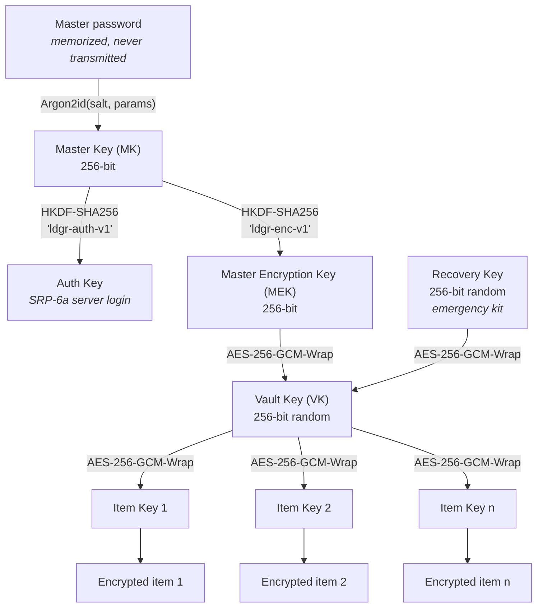
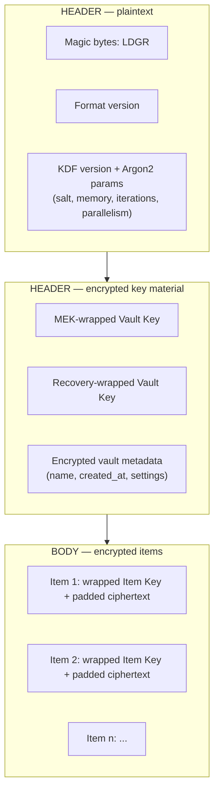
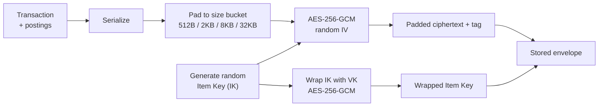
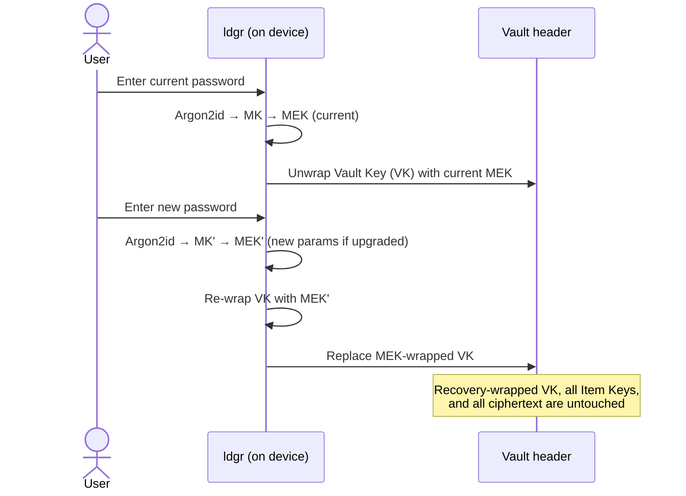
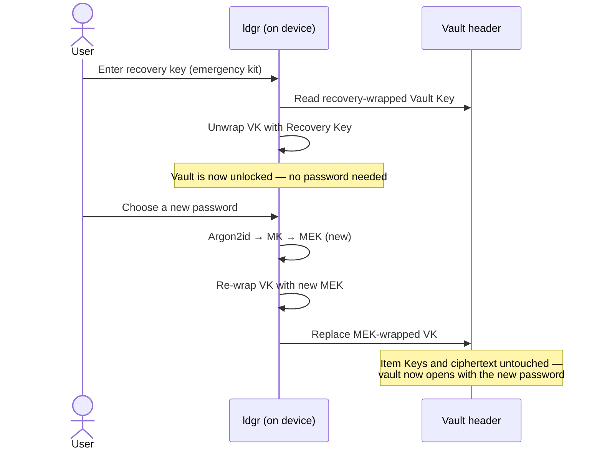

# How the vault container works

> **Who this is for:** developers, sysadmins, and auditors with basic security
> literacy. You don't need to be a cryptographer, but you should be comfortable
> with terms like "key derivation", "symmetric encryption", and "authenticated
> encryption". If you'd prefer the plain-English version, start with
> [How is my data protected?](./vault-overview.md). If you need exact byte
> offsets for re-implementation or audit, jump to the
> [Expert specification](./vault-format-spec.md).

This guide explains the *shape* of an ldgr vault: how keys are organized, how a
single transaction becomes an encrypted envelope, and what actually happens when
you change your password or recover a vault. It is technical, but deliberately
**not implementation-specific** — there is no source code here, and the binary
details (field sizes, endianness, framing) are left to the
[expert specification](./vault-format-spec.md).

---

## Design goals

The vault format exists to deliver four properties at once:

- **Zero-knowledge.** The server and any sync transport only ever see encrypted
  blobs. Encryption and decryption happen exclusively on your devices.
- **Local-first.** The canonical copy of your data lives on your device. Sync is
  an optimization, not a dependency.
- **Item-level (envelope) encryption.** Every item — a transaction, an account,
  a budget — is sealed individually with its own random key. Nothing shares a key
  or an IV with anything else.
- **Crypto-agility.** Key-derivation parameters and format versions are recorded
  in the vault header so they can be strengthened over time without breaking
  existing vaults.

Everything below is in service of those four goals.

---

## Key hierarchy

ldgr never encrypts your data directly with your password. Instead it derives a
chain of keys, where each key's only job is to protect the next one down. This is
**envelope encryption**: cheap, hierarchical, and easy to re-key.

The two important branches:

- The **password path**: your password is stretched by Argon2id into the Master
  Key, which HKDF splits into an Auth Key (used only for server authentication via
  SRP-6a) and the Master Encryption Key. The MEK *wraps* (encrypts) the Vault Key.
- The **recovery path**: a 256-bit random Recovery Key independently wraps the
  *same* Vault Key. This is why recovery works without ever knowing your
  password — it's a second lock on the same door, not a copy of the key behind it.

Below the Vault Key, each item has its own random Item Key, wrapped by the VK.

| Key | How it's obtained | Size | Persisted? | Purpose |
|-----|-------------------|------|------------|---------|
| Master Key (MK) | Argon2id(password, salt) | 256-bit | No — ephemeral | Root of the password path |
| Auth Key | HKDF-SHA256(MK, `ldgr-auth-v1`) | 256-bit | No — ephemeral | SRP-6a server authentication only |
| Master Encryption Key (MEK) | HKDF-SHA256(MK, `ldgr-enc-v1`) | 256-bit | No — ephemeral (may be cached behind biometrics) | Wraps the Vault Key |
| Recovery Key (RK) | CSPRNG at vault creation | 256-bit | Only by *you*, offline | Alternate wrap of the Vault Key |
| Vault Key (VK) | CSPRNG at vault creation | 256-bit | Yes — stored **wrapped** | Wraps every Item Key |
| Item Key (IK) | CSPRNG per item | 256-bit | Yes — stored **wrapped**, alongside its item | Encrypts one item's payload |

The only secrets ever written to disk are the *wrapped* VK and the *wrapped* Item
Keys. The MK, MEK, and Auth Key are derived on unlock and zeroized from memory on
lock or timeout. The Recovery Key is never stored by ldgr at all — it lives only
in your emergency kit.

---

## Vault file structure

A vault is a single container with a small **plaintext header** and an encrypted
**body**. The header carries exactly what's needed to begin unlocking — and
nothing sensitive.

What's plaintext vs. encrypted:

- **Plaintext (header only):** the magic bytes, the format and KDF version, and
  the Argon2id parameters (salt, memory cost, iterations, parallelism). These
  *must* be readable before any key exists — you can't derive the MK without them.
  None of this reveals anything about your finances.
- **Encrypted (everything else):** both wrapped copies of the Vault Key, the vault
  metadata blob, and every item in the body. Even the vault's name and creation
  date are sealed.

Internally the canonical store is a versioned SQLite database (soft deletes, a
version column per row); the vault container is how that store is sealed at rest
and in transit. The body is just a sequence of independently encrypted items.

---

## Encryption flow: one transaction → one envelope

Items are encrypted one at a time. A transaction (with all of its postings, which
are always treated as a single atomic unit) becomes an encrypted envelope like
this:

1. **Serialize.** The full transaction state is serialized into a byte payload.
2. **Pad to a size bucket.** The payload is padded up to the nearest bucket —
   512 B, 2 KB, 8 KB, 32 KB, or a multiple of 32 KB beyond that. This prevents an
   observer from inferring a transaction's complexity from its ciphertext length.
3. **Generate a fresh Item Key.** A new 256-bit key from the CSPRNG, used for this
   item and nothing else.
4. **Encrypt.** AES-256-GCM with a random IV seals the padded payload, producing
   ciphertext plus an authentication tag.
5. **Wrap the Item Key.** The Item Key is itself encrypted with the Vault Key
   (AES-256-GCM) and stored next to the ciphertext.

**Domain separation via AAD.** Each wrapping operation binds its ciphertext to a
distinct Additional Authenticated Data tag, so a wrapped key from one layer can
never be replayed at another:

- `ldgr-vault-wrap-v1` — wrapping the Vault Key with the MEK
- `ldgr-item-wrap-v1` — wrapping an Item Key with the Vault Key
- `ldgr-recovery-wrap-v1` — wrapping the Vault Key with the Recovery Key

Because every item has its own key and IV, items are encrypted, synced, and
conflict-resolved independently — and re-keying one item never touches another.

---

## Password change flow

Changing your password is **cheap**, because your password only ever protected the
Vault Key — never your data directly. None of your items are re-encrypted.

In words: unwrap the VK with the old MEK, derive a new MEK from the new password
(optionally with stronger Argon2id parameters), re-wrap the *same* VK, and write
just that one wrapped-key field back. Every Item Key and every encrypted item is
left exactly as it was. The recovery path is unaffected — your old emergency kit
still works.

---

## Recovery flow

Recovery uses the second lock on the Vault Key. The Recovery Key unwraps the VK
directly, with no password involved, after which you set a fresh password.

The trade-off is deliberate and unavoidable: there are exactly two ways to reach
the Vault Key — your password and your recovery key. If **both** are lost, the VK
can never be unwrapped, and the data is permanently unrecoverable. There is no
master key and no back door, because either of those would defeat the zero-
knowledge guarantee for everyone.

---

## How ldgr compares

A quick orientation against other well-known formats. "Item-level encryption"
means each record gets its own key/IV rather than the whole container being
sealed as one blob.

| Format | Key derivation | Item-level encryption | Recovery mechanism | Open spec | Sync model |
|--------|----------------|-----------------------|--------------------|-----------|------------|
| **ldgr vault** | Argon2id → HKDF | Yes — per-item key, wrapped by Vault Key | Recovery key (2nd wrap of Vault Key) | Yes — public, this doc set | Zero-knowledge, item-granular encrypted sync |
| 1Password (OPVault / `.b8`) | PBKDF2 / Argon2 (account key + password) | Yes — per-item keys | Account Key + Emergency Kit | Partial (OPVault documented; current format proprietary) | Hosted, zero-knowledge sync |
| KeePass KDBX 4 | Argon2 / AES-KDF | No — whole database encrypted as one blob | Key file / composite key (no built-in recovery) | Yes — community-documented | Manual file sync (no protocol) |
| age | scrypt (passphrase) or X25519 (keys) | No — whole stream/file encrypted | None (manage your own keys) | Yes — public spec | None (file-oriented tool) |
| GPG symmetric (`--symmetric`) | S2K (iterated+salted) | No — whole message encrypted | None | Yes — OpenPGP RFC | None (file-oriented) |

The distinguishing combination for ldgr is **per-item envelope encryption plus a
dedicated recovery key plus a sync model designed around encrypted, independently
mergeable items** — rather than a single monolithic encrypted file.

---

## What this guide does not cover

By design, this guide stops at the conceptual level. For more depth:

- **Exact binary layout** — field offsets, types, endianness, framing:
  [Expert specification](./vault-format-spec.md).
- **Polished, standalone diagrams** — the rendered key-hierarchy, structure, and
  sequence assets live in [`diagrams/`](./diagrams/).
- **Full threat model** — adversary capabilities, what's in and out of scope:
  see the vault threat-model document (in progress).
- **Interoperability test vectors** — known-answer inputs/outputs for
  independent implementations (in progress).

---

## Further reading

- **Up:** [How is my data protected?](./vault-overview.md) — the non-technical
  overview this guide builds on.
- **Down:** [Vault format — Expert specification](./vault-format-spec.md) — the
  formal binary format for re-implementation and audit.
- **Across:** [ldgr Architecture](../ldgr-architecture.md) — the full system
  design, including the encryption architecture (§4) and security decisions.
